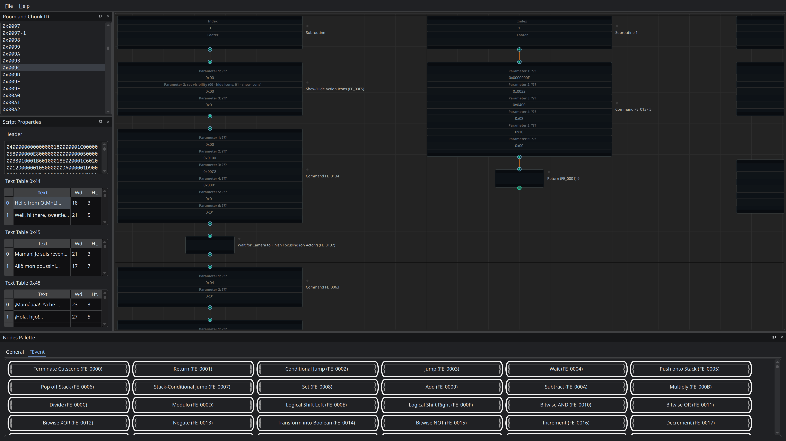

# QtMnL

QtMnL (pronounced “cute emm-'n'-ell”, after the framework Qt, officially pronounced “cute”) is a GUI editor for the Mario & Luigi games, although it currently only supports Bowser's Inside Story (the original DS version). It is built using [PySide6](https://doc.qt.io/qtforpython-6/), [NodeGraphQt (Qt 6 fork)](https://github.com/jack-mil/NodeGraphQt/tree/pyside6), [`ndspy`](https://ndspy.readthedocs.io), [`mnllib.py`](https://github.com/MnL-Modding/mnllib.py) and the [YAML command documentation](https://github.com/MnL-Modding/BIS-docs/tree/main/cutscene_code).

## Downloads
Pre-built binaries for Windows (`.exe`) and Linux (`.bin`) made with [Nuitka](https://nuitka.net/) can be found on the [Releases](https://github.com/MnL-Modding/QtMnL/releases) page.

## Frequently asked questions
### 1. Why is loading a script so slow and why does it use up so much RAM?
Because adding a whole bunch of nodes in NodeGraphQt is slow and uses up a lot of RAM. There even appears to be a memory leak in the graph when deleting the old nodes when switching scripts, but I can't find it with `tracemalloc`, so that's fun. Unfortunately, NodeGraphQt is the only real node graph UI framework for Python and Qt, so the only real way I can fix this is to make my own one, but even then, we're dealing with Python here, so a more performant language would probably be required.

I've probably missed some optimization opportunities as well, but honestly, I'm too tired to go hunting for them. If anyone notices something, by all means point it out.

### 2. Which regional versions of the game are supported?
All regions should work, though only the US version is regularly tested.

### 3. I added/removed a single command and everything broke. What's going on?
Because jump commands currently have the number of bytes to jump as just a normal field rather than a connector, you must manually update all offsets broken by the command you added/removed. This is probably the thing I'll work on next, as it is very annoying.

### 4. The cutscene is continuing without waiting for me to close the textbox!
You need a `Wait for Textbox to Close (FE_01BD)` command afterwards in order to wait for it to close. Also make sure the `wait before continuing` parameter of your Show Textbox command is set to `0x00`.

### 5. Can you summarize the differences between QtMnL (pretty much the same points apply to Showtime!) and `mnlscript`?
| Feature                                 | QtMnL |  `mnlscript`  |
| --------------------------------------- | :---: | :-----------: |
| Ease-of-use                             |   ✅   | *Skill issue* |
| Edit ROM without extracting/decompiling |   ✅   |   *Git gud*   |
| Comments                                |   ❌   |       ✅       |
| Variables                               |   ❌   |       ✅       |
| Dynamically-generated commands          |   ❌   |       ✅       |
| Git-friendliness                        |   ❌   |       ✅       |
| Easy collaboration on the same project  |   ❌   |       ✅       |
